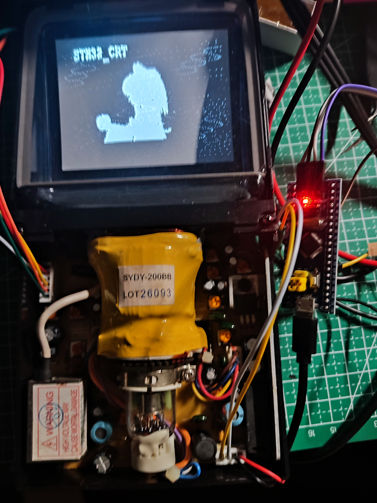
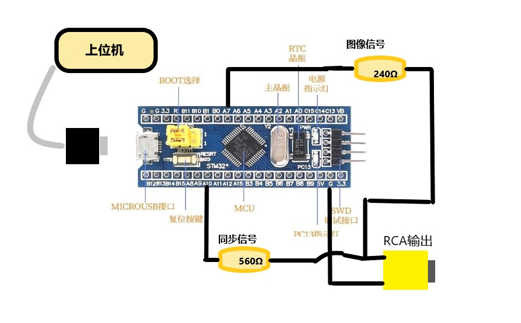

# 
 STM32 HAL 驱动CRT显示器播放Bad Apple

## 简介
&emsp;本项目使用STM32F103C8T6单片机输出NTSC信号，通过RCA接口连接CRT显示器.
内置ASII码字库，可以实现简单的字符串显示和图片显示功能、受制于STM32F103C8T6性能以及没有DAC原因，MCU只能输出黑白图像信号。

&emsp;配置USB虚拟串口、上位机直接通过USB连接STM32播放传输数据，从而通过USB通信传输图像数据实时播放Bad Apple视频。

***  

## 参考
__参考借鉴了以下项目:__
1. 显示驱动: [ArduinoSTM32_TNTSC][1]  

2. 上位机&emsp;: [oled_display_gui][2]

***  

## 开发准备
> 1. 硬件准备：
> >  - STM32f103C8T6, 560和240Ω的电阻, CRT显示器, RCA线
> 2. 软件准备：
> >  - KEIL5 ， STM32CuBeMX, OLED_ToolBox

***  

## 接线图  

  

***  

## 注意  

&emsp;由于上位机传输图像需要缓冲区存储，因此显示分辨率不能太大！ 否则内存会爆! 目前为SC_224x108分辨率。

***  

## 图像配置  

&emsp;波特率建议采用100000，分辨率采用160*80，横向扫描，字节横向排列。LSB
&emsp;ntsc.c文件里面给出调用接口

[1]: https://github.com/Tamakichi/ArduinoSTM32_TNTSC#arduino-stm32-ntsc%E3%83%93%E3%83%87%E3%82%AA%E5%87%BA%E5%8A%9B%E3%83%A9%E3%83%96%E3%83%A9%E3%83%AA
[2]: https://github.com/AnChangNice/oled_display_gui
